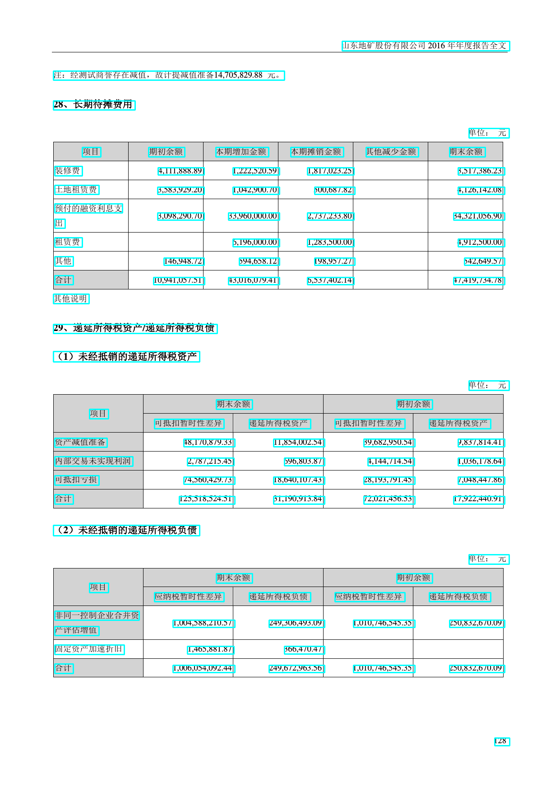

# document-ocr

一个相对完整的文档分析和识别项目含以下五部分:

1. 文档分析数据，
2. 识别数据合成工具，
3. 文档版面分析模型，
4. 文本行识别模型，
5. 单字识别模型

### 数据

数据从网络抓取的公开上市公司年报数据 PDF　文件解析生成，有图片和文本的位置信息

[一份样例](./dataset/sample)

[网盘下载地](https://pan.baidu.com/s/1dcZAqRxJtsXw9l0n6j8pbg) 提取码: nn1g

文本数据是标注到文本行的，部分数据会有些瑕疵，共34000样本

可以根据标注数据生成文本行识别数据

#### 识别数据合成

单字和文本行[数据合成工具](https://github.com/rockyzhengwu/synthtext) 能比较好的过滤字体中不支持的字符

## 相关算法实现
所有代码依赖 Tensorflow 1.14 和 opencv 3.x

1. [版面分析](./layout_analysis/README.md)
2. [文本行识别](./crnn_ocr/README.md)
3. [单字识别](./single_word_ocr/README.md)

### 注

 - 代码还有很多需要完善的地方，不在此列举，欢迎各种 issue

 - 代码中有很多参数没有提出到命令行比如 learning_rate 等，希望使用的时候多读下代码
