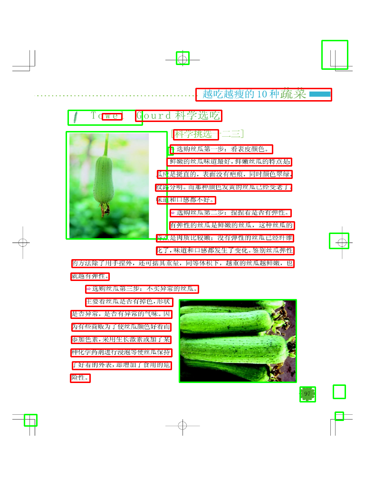

# 版面分析

## 简介

模型使用 UNet 结构在训练时用一个decoder 作为辅助，整体架构如下图


## 用法

1. 数据准备
　准备数据如[样例](https://gitee.com/rockyzheng/document-ocr/blob/master/dataset/sample)
  生成label_list 文件如下

  ```
  /data/1.xml
  /data/2.xml
  ```
  在 [data_factory.py](./dataset/data_factory.py) 中配置相关参数

  可自行生成其他格式数据实现对应的　data_generator 即可

2. 训练

```
python train.py --name <task_name>
```

3. 测试 & 导出模型
```
python --eval.py --name <task_name>
python --eval.py --export 
```

4. 加载导出的模型
在 ```load_saved_mode.py`` 中添加模型位置然后运行就能运行测试导出的模型或者对外提供API



